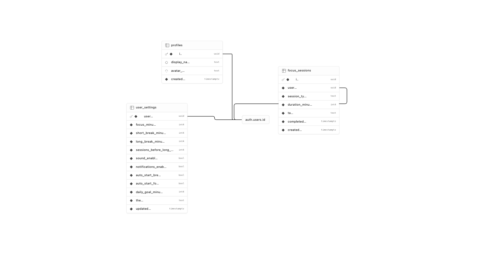

# 🌿 Focus Grove

A calm, hand-drawn focus & productivity app — a cozy clock, a pomodoro
cycle, a free-form timer, and a little stats garden, all kept company by
**Maple**, an animated cat who breathes, blinks, naps through your
breaks, stretches on long ones, and celebrates your wins.

Built with **Vite + React + TypeScript**, **Framer Motion**, and
**Lucide** icons. Runs entirely without a backend in mock mode.

## Quick start

```bash
npm install
npm run dev      # → http://localhost:5173  (mock sign-in, no credentials needed)
npm run build    # type-check + production build
npm run lint     # oxlint
npm test         # vitest (timer + storage tests)
```

## Features

- **Clock** — big local time, date, time-of-day motivational message,
  ambient scenery that follows the day (morning sun & leaves, afternoon
  dust motes, warm evenings, starry nights with fireflies), and a focus
  mode that dims the chrome and wraps the clock in a breathing halo.
- **Pomodoro** — 25/5/15 defaults (adjustable), long break every 4th
  session, a focus intention field (“What are you focusing on?”), an
  illustrated session timeline (sprouts for focus, coffee for breaks),
  today’s session count and focus minutes, auto-start for the next
  phase, and a companion that mirrors the timer: focused with a pencil,
  asleep on short breaks, stretching on long ones, celebrating on
  completion — and only gently wistful if you reset midway.
- **Timer** — quick presets (5/10/15/30/60m) or custom minutes:seconds,
  progress ring, completion overlay with confetti, “Go again” / “Done”,
  tracked separately from pomodoro sessions.
- **Garden** — a cozy stats page (never a dashboard): today’s minutes
  and sessions, a daily focus goal with a growing sprout, current
  streak, a 7-day activity view drawn as little plants, and history
  grouped by day with the task you focused on. Friendly empty states.
- **Reliability** — wall-clock timers that stay accurate in hidden tabs
  and survive full page reloads; a running timer that ends while you’re
  away completes properly on return. Browser notifications (permission
  asked only when you turn them on), dynamic document title
  (`24:32 — Focus Grove`), keyboard shortcuts (**Space** start/pause,
  **R** reset, **S** skip — never while typing).
- **Comfort** — light/dark cozy themes, sound toggle (Web Audio chime),
  everything persisted per-user in `localStorage` with corrupted-data
  recovery, reduced-motion support, ≥44px touch targets, safe-area
  padding, sticky controls on small screens, an error boundary, and a
  PWA manifest so it can be installed to a home screen.

## Architecture

```
src/
├── App.tsx                     # error boundary + auth splash + tab routing
├── types.ts                    # TabId, User, FocusSession, FocusStats, moods…
├── auth/                       # ── pluggable auth ──
│   ├── types.ts                # AuthAdapter interface + friendly AuthError
│   ├── mockAdapter.ts          # zero-credential dev sign-in
│   ├── supabaseAdapter.ts      # real Google OAuth via Supabase (redirect flow)
│   ├── firebaseAdapter.ts      # documented stub w/ full reference impl
│   └── index.ts                # auto-detects supabase from env, else mock
├── lib/
│   ├── supabase.ts             # shared client + config validation
│   └── db.ts                   # typed reads/writes (sessions, settings, profile)
├── context/
│   ├── AuthContext.tsx         # user / isInitializing / isSigningIn / error
│   ├── SessionsContext.tsx     # offline-first session log + cloud sync queue
│   └── SettingsContext.tsx     # prefs: local first, synced to user_settings
├── hooks/
│   ├── useCountdown.ts         # wall-clock countdown + persistence (tested)
│   ├── useSafeLocalStorage.ts  # validated storage + per-user keys (tested)
│   ├── useSessions.ts          # re-export of SessionsContext + focus task
│   ├── useFocusStats.ts        # today / streak / 7-day / by-day rollups
│   ├── useNotifications.ts     # opt-in browser notifications
│   ├── useKeyboardShortcuts.ts # input-safe global hotkeys
│   ├── useDocumentTitle.ts     # “24:32 — Focus Grove”
│   ├── useChime.ts             # two-note Web Audio chime
│   └── useNow.ts               # ticking Date for the clock
└── components/                 # AppShell, views, Maple, garden widgets…
```

Timer logic lives entirely in hooks; components only render.

### Timer accuracy & persistence

`useCountdown` never accumulates ticks. While running it stores the
absolute end timestamp and recomputes `remaining = endAt - Date.now()`
on each tick **and** on `visibilitychange`, so throttled tabs can’t
drift. With a `persistKey` it also writes `{endAt, remainingMs,
totalMs}` to `localStorage` on start/pause/reset — a reload restores a
running timer mid-flight, and one that expired while away fires its
completion on the next mount. See `src/hooks/__tests__/`.

### Connecting real Google sign-in (Supabase)

The app auto-detects its mode: with no env vars it runs the **mock**
adapter (Google button signs in a sample user, no credentials needed);
once `.env.local` has Supabase keys it switches to **cloud mode** with
real Google OAuth and data sync.

1. **Env vars** — copy `.env.example` → `.env.local` and set:

   ```
   VITE_SUPABASE_URL=https://yourproject.supabase.co
   VITE_SUPABASE_ANON_KEY=eyJ…
   ```

   ⚠️ Frontend env vars must only ever contain the public **anon** key.
   The service-role key bypasses Row Level Security — keep it server-side
   only. (`.env.local` is gitignored via `*.local`.)

2. **Google provider** — Supabase dashboard → Authentication →
   Providers → Google → paste your Google Cloud OAuth client ID/secret.
   Under Authentication → URL Configuration add `http://localhost:5173`
   and your production URL to the redirect allow-list, and set the
   production Site URL.

3. **Database** — open the SQL Editor and run `supabase/schema.sql`
   (idempotent). It creates:
   - `profiles`, `focus_sessions`, `user_settings`
   - RLS policies so users can only read/insert/update/delete their
     **own** rows — one user can never see another's sessions
   - an `on_auth_user_created` trigger that creates the profile (Google
     name + avatar) and default settings on first login, without ever
     overwriting them on later logins

   The resulting schema:

   

That's it — sign-in uses the OAuth **redirect** flow (reliable on
iPad/mobile), sessions persist across reloads via
`supabase.auth.getSession()`, and expired tokens refresh automatically.

### Cloud data sync (offline-first)

`src/lib/db.ts` + `SessionsContext` / `SettingsContext` implement a
gentle sync layer:

- **localStorage is always written first** — the UI never waits on the
  network, and timer state stays local by design.
- Completed sessions are inserted into `focus_sessions`; if the insert
  fails (offline) the session joins a pending queue that retries on the
  browser `online` event and on the next login. Uploads are idempotent
  (`upsert … ignoreDuplicates`), so retries can't duplicate rows.
- Settings load from `user_settings` after login (cloud wins), and every
  change saves back; failed saves set a dirty flag and push later.
- The Garden tab shows a friendly status pill: “Syncing…”, “Synced to
  your account”, or “Saved locally — will sync when you're back online.”

The `AuthAdapter` interface (`src/auth/types.ts`) still keeps the
backend swappable — `firebaseAdapter.ts` remains as a documented stub.

### Per-user data

All user data is namespaced as `focus-grove:<userId>:<suffix>`
(sessions, tasks, timer state, pomodoro progress), so two accounts on
one machine never mix. Legacy single-user session data is migrated
automatically on first sign-in. Corrupted values are detected,
discarded, and repaired rather than crashing the app.

### Design language

Warm paper tokens (cream / sage / dusty blue / warm yellow / terracotta
/ brown) as CSS custom properties in `src/index.css`, flipped by
`[data-theme='dark']`. The hand-drawn feel comes from wobbly asymmetric
border-radii, dashed outlines, an SVG-noise grain overlay, `Caveat`
display type and `Nunito` UI type. Maple uses her own `--cat-*` palette
so her eyes stay dark and cute in dark mode. All motion respects
`prefers-reduced-motion` — static illustrations, instant transitions.
